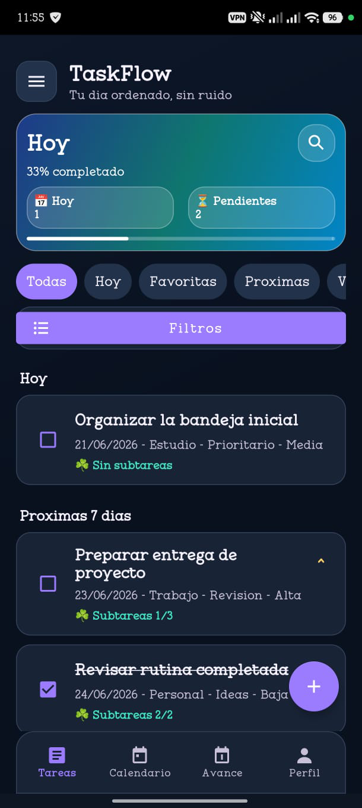

# TaskFlow

TaskFlow es una aplicacion Android nativa en Java para gestionar tareas personales o academicas de forma local, sin Firebase, backend remoto, PostgreSQL ni sincronizacion en la nube.

## Problema que resuelve

Ayuda a estudiantes universitarios y usuarios personales a registrar tareas, subtareas, fechas limite, recordatorios, proyectos, etiquetas, filtros y progreso diario dentro del telefono.

## Tecnologias

- Android nativo con XML layouts.
- Java como lenguaje de aplicacion.
- Gradle wrapper 9.4.1.
- Android Gradle Plugin 9.2.0.
- Java toolchain 21.
- Room sobre SQLite local.
- MVVM simple con ViewModel y LiveData.
- Repository + DAO.
- AppCompat, Material Components, ConstraintLayout y RecyclerView.
- Notificaciones locales con AlarmManager y NotificationChannel.

## Java 21 y SDK local

El proyecto esta configurado con:

- `java.toolchain.languageVersion = 21`.
- `sourceCompatibility = JavaVersion.VERSION_21`.
- `targetCompatibility = JavaVersion.VERSION_21`.

Verificacion local realizada:

- `java -version` del PATH global mostraba JDK 25.
- El proyecto se verifico ejecutando Gradle con `JAVA_HOME=C:\Program Files\Java\jdk-21`.
- `./gradlew -version` confirmo Launcher JVM 21.0.8.
- El SDK instalado en esta maquina contiene `platforms/android-36.1`, por eso `app/build.gradle` usa `compileSdkVersion 'android-36.1'`.

## Funcionalidades implementadas

TaskFlow cuenta con funcionalidades principales ya implementadas para el flujo local de autenticación, gestión de tareas y organización personal dentro del dispositivo.

### Autenticación local

* Registro local de usuario con nombre, correo, nombre de usuario y contraseña.
* Inicio de sesión local con usuario/correo y contraseña.
* Conservación de sesión activa mediante `SharedPreferences`.
* Cierre de sesión local desde el perfil del usuario.
* Validación de credenciales desde la base de datos local.
* Hash de contraseña mediante `PasswordUtils`, evitando guardar contraseñas en texto plano.
* Navegación automática hacia la pantalla principal cuando existe una sesión activa.

### Validaciones de formularios

* Validación de campos obligatorios en login y registro.
* Validación de longitud mínima de contraseña.
* Validación de confirmación de contraseña en el registro.
* Mensajes de error visibles dentro del formulario.
* Notificaciones breves al usuario cuando los datos ingresados no cumplen las condiciones requeridas.

### Gestión de tareas

* Creación, consulta, edición y eliminación de tareas.
* CRUD de tareas filtradas por `activeUserId`.
* Subtareas persistidas con `SubtaskEntity`.
* Proyectos, secciones, etiquetas y relación muchos a muchos entre tareas y etiquetas.
* Búsqueda de tareas por texto.
* Filtros por estado: todas, hoy, próximas, vencidas, completadas, pendientes, sin fecha y archivadas.
* Prioridades baja, media, alta y urgente.
* Duplicado de tareas, archivo/restauración y plantillas reutilizables.

### Planificación y seguimiento

* Calendario básico por fecha.
* Tablero local con estados: por hacer, en progreso y listo.
* Tareas recurrentes diarias, semanales o mensuales.
* Hasta tres recordatorios por tarea.
* Recordatorios locales con manejo de fechas pasadas y permisos de notificación.
* Acciones de notificación para completar o posponer tareas.
* Temporizador de tarea con cuenta regresiva.
* Estadísticas locales de productividad.
* Exportación local a JSON.
* Widget de pantalla de inicio con resumen de tareas del día.
* Perfil de usuario y preferencia de tema.
* Modo oscuro con estilo morado.
* Datos demo controlados al registrar el primer usuario.

### Evidencia visual

Captura de la pantalla de inicio de sesión de TaskFlow:



### Video de demostración

[Video de demostración del flujo de autenticación de TaskFlow](https://uceedu-my.sharepoint.com/:f:/g/personal/fmtopon_uce_edu_ec/IgB8A32SzpaYRry5ZTlx1ZgLAeqVNTqYwRHheBZQzy152Ks?e=z8sQl2)

## Fuera de alcance

- Sin nube, API externa obligatoria o backend.
- Sin Compose ni Kotlin para la app.
- Sin Firebase ni PostgreSQL.
- La vista PRO del menu lateral es solo visual/informativa.

## Abrir en Android Studio

1. Abrir la carpeta `TaskFlow`.
2. Esperar sincronizacion Gradle.
3. Confirmar que Android Studio use JDK 21 o que `JAVA_HOME` apunte a JDK 21.
4. Ejecutar el modulo `app`.

## Comandos

Desde la carpeta `TaskFlow`:

```powershell
$env:JAVA_HOME='C:\Program Files\Java\jdk-21'
$env:Path="$env:JAVA_HOME\bin;$env:Path"
.\gradlew.bat clean
.\gradlew.bat assembleDebug
.\gradlew.bat testDebugUnitTest
```

Para pruebas instrumentadas se requiere emulador o dispositivo:

```powershell
.\gradlew.bat connectedAndroidTest
```

## Documentacion

La carpeta `docs/` contiene manual tecnico, manual de usuario, pruebas, bugs/mejoras, guion de video demo y evidencias pendientes.
